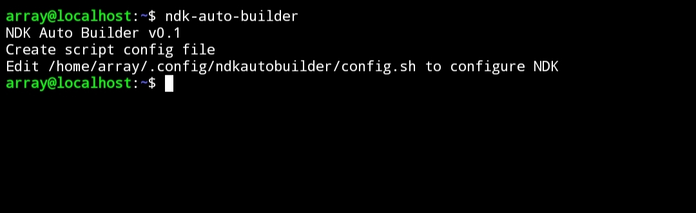
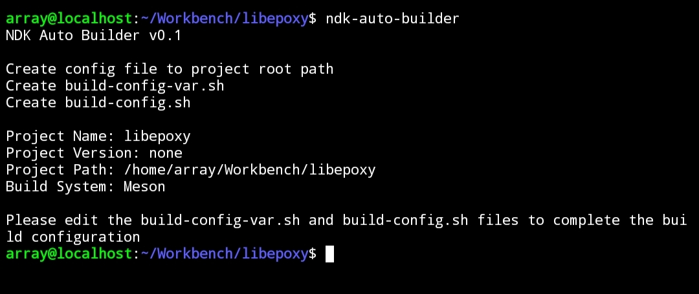

# NDK-Auto-Builder

一个便携式的NDK自动交叉编译脚本，他不像Termux Packages那样庞大复杂，主要依靠针对单个项目创建的配置脚本进行交叉编译，自动完成每个架构的配置到编译安装，目前还没有自动打包

# 主要特性

|:----------------|:-:|
| 支持的环境      |   |
| 任何Linux发行版 | ✔ |
| WSL             | ✔ |
| Proot/Chroot    | ✔ |

|:---------------|:-:|
| 支持的构建系统 |   |
| Meson          | ✔ |
| Cmake          | ✔ |
| Autotools      | ✔ |
| Make           | ✔ |

|:-------------------|:-:|
| 特性               |   |
| 识别项目基本信息   | ✔ |
| 自动识别构建系统   | ✔ |
| 可识别多个构建系统 | ✔ |
| 自动构建选择的架构 | ✔ |
| 可自定义的构建脚本 | ✔ |

# 如何使用

**注意：此脚本没有标准选项如--help，--version，只需不带任何参数执行ndk-auto-builder即可**

首次运行会在标准$HOME/.config文件夹里创建通用配置文件然后退出，可以为脚本全局设置NDK路径，要构建的架构，安装位置以及pkg-config pc文件的位置

通用配置完成后，在项目的跟路径执行ndk-auto-builder可为项目创建两个配置文件，分别为保存项目信息的build-config-var.sh以及主要用于构建的build-config.sh，两个配置文件由主脚本ndk-auto-builder执行

为项目设置构建的架构，安装位置，依赖位置等等，通常会被通用配置文件覆盖为默认值，当然可以为当前项目修改这些默认值。完成这些后在项目跟路径执行ndk-auto-builder即可开始构建，如何没有错误他将为选择的架构构建然后安装到指定的路径

# 贡献

为保证准确性没有使用谷歌翻译来写出糟糕的README，所以暂时只能使用中文来写，显然是因为我的英语水平还做不到🤣。如果你会中文并且能够翻译他们我将感激不尽！
